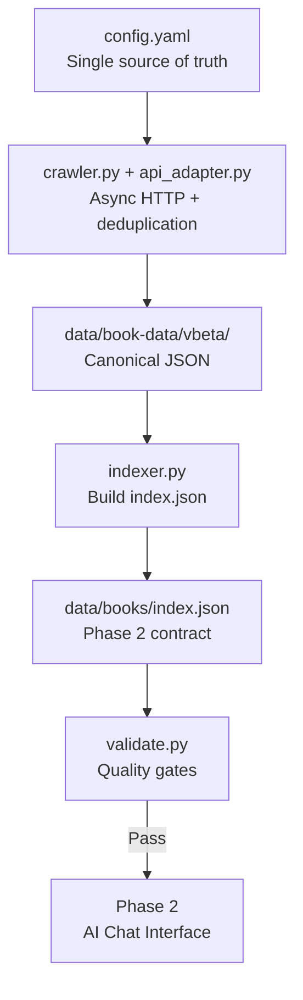

# Monkai — Smart Buddhist Scripture Library

> **Thư Viện Kinh Phật Thông Minh** — A multi-phase project to crawl, index, and serve Buddhist scriptures through an AI-powered interface.

## Table of Contents

- [Overview](#overview)
- [Architecture](#architecture)
- [Project Status](#project-status)
- [Quick Start](#quick-start)
- [Installation](#installation)
- [Configuration](#configuration)
- [Data Models](#data-models)
- [Testing](#testing)
- [Roadmap](#roadmap)

## Overview

Monkai collects Buddhist scriptures from authoritative Vietnamese digital libraries, normalizes them into a structured corpus, and provides a foundation for an AI-powered chat interface.

**What you get:**

- A configuration-driven web crawler that respects `robots.txt` and rate limits
- Deterministic, deduplication-safe metadata extraction using Vietnamese-aware ID generation
- Incremental crawl state — interrupted runs resume where they left off
- A frozen `index.json` schema that serves as the handoff contract to the AI layer

**Supported scripture traditions:**

| Tradition | Vietnamese | Description |
|-----------|------------|-------------|
| Nikaya | Nguyên Thủy | Theravāda — Pali canon |
| Đại Thừa | Đại Thừa | Mahāyāna — East Asian Buddhism |
| Mật Tông | Mật Tông | Vajrayāna — Tantric Buddhism |
| Thiền | Thiền | Zen Buddhism |
| Tịnh Độ | Tịnh Độ | Pure Land Buddhism |

## Architecture



### Key Design Principles

- **Single source of truth** — all sources and CSS selectors live in `config.yaml`; no code changes needed to add a new site
- **Deterministic IDs** — `{source_slug}__{title_slug}` generated via `make_id()`, stable across re-runs
- **Incremental and resumable** — crawl state persisted in `data/crawl-state.json`
- **Robot-compliant** — `robots.txt` fetched once per domain, cached in-memory
- **Idempotent** — re-running the same inputs produces identical outputs

## Project Status

| Component | Status |
|-----------|--------|
| Environment setup | ✅ Complete |
| Data models (Pydantic API mappings) | ✅ Complete |
| Utilities package | ✅ Complete |
| API Web crawler (`crawler.py`) | ✅ Complete |
| 148 tests passing | ✅ Complete |
| Index builder (`indexer.py`) | ✅ Complete |
| Validation utility (`validate.py`) | ✅ Complete |
| Phase 2 — AI chat interface | 📋 Planned |
| Phase 3 — Advanced features | 📋 Planned |

## Quick Start

```bash
# 1. Clone and enter the project
git clone <repo-url> monkai
cd monkai

# 2. Start the Devbox environment (recommended)
devbox shell

# 3. Install dependencies
uv sync

# 4. Verify everything works
devbox run test

# 5. Run the crawler (all 4 sources)
devbox run crawl
```

You'll see 177 tests passing.

## Installation

### Prerequisites

Choose one of the following setups:

**Option A: Devbox (recommended — fully reproducible)**

Install [Devbox](https://www.jetify.com/devbox), then:

```bash
devbox shell   # activates Python 3.11 + uv automatically
uv sync
```

**Option B: Python 3.11 + uv directly**

Install [uv](https://docs.astral.sh/uv/getting-started/installation/), then:

```bash
uv sync        # reads pyproject.toml, creates .venv, installs all deps
```

### Available Scripts

| Command | Description |
|---------|-------------|
| `devbox run test` | Run the full test suite with pytest |
| `devbox run crawl` | Run the crawler across all 4 configured sources |
| `devbox run parse` | Run the metadata parser |
| `devbox run index` | Build the index manifest |
| `devbox run build` | Build the e-book manifests and structures |
| `devbox run lint` | Lint with ruff |
| `devbox run format` | Format with ruff |

## Configuration

`config.yaml` is the single configuration file for all pipeline behaviour.

```yaml
output_dir: data          # Root directory for downloaded files
log_file: logs/crawl.log  # Rotating log file path

api_base_url: https://api.phapbao.org

api_endpoints:
  categories: /categories/get-selectlist-categories?hasAllOption=false
  books: /search/get-books-selectlist-by-categoryId
  toc: /search/get-tableofcontents-by-bookId
  pages: /search/get-pages-by-tableofcontentid/{id}

sources:
  - name: vbeta
```

### Configured Sources

| Source | Content |
|--------|---------|
| `vbeta.vn` | Comprehensive digitized Vietnamese Tripitaka API |

## Data Models

All models are defined in `models.py` using Pydantic v2.

### ChapterBookData (Canonical Format)

The per-chapter data contract ingested to Disk:

```python
class ChapterBookData(BaseModel):
    meta: ChapterMeta = Field(..., alias="_meta")
    id: str                                 # e.g. "vbeta__1-kinh-pham-vong"
    chapter_id: int
    chapter_name: str
    chapter_seo_name: str
    chapter_view_count: int = 0
    page_count: int
    book: BookInfo
    pages: list[PageEntry]                  # array of HTML payloads
```

### IndexRecord

The frozen Phase 2 handoff contract written to `data/index.json`:

```python
class IndexRecord(BaseModel):
    id: str
    title: str
    category: Literal["Nikaya", "Đại Thừa", "Mật Tông", "Thiền", "Tịnh Độ"]
    subcategory: str
    source: str
    url: str
    file_path: str
    file_format: Literal["html", "pdf", "epub", "other"]
    copyright_status: Literal["public_domain", "unknown"]
```

## Project Structure

```text
monkai/
├── config.yaml              # All source configuration (4 sources)
├── crawler.py               # Async web crawler CLI entry point
├── parser.py                # Metadata extraction
├── indexer.py               # Index building
├── book_builder.py          # EPUB structure compilation
├── models.py                # Pydantic data models
├── pyproject.toml           # Project manifest and dependencies
├── utils/
│   ├── config.py            # Load and validate config.yaml
│   ├── dedup.py             # SHA-256 duplicate detection
│   ├── logging.py           # Dual-output rotating logger
│   ├── robots.py            # robots.txt caching and compliance
│   ├── slugify.py           # Vietnamese ID generation
│   └── state.py             # Crawl state persistence
├── tests/
│   ├── conftest.py
│   ├── test_catalog_fetch.py     # Catalog fetch + URL extraction
│   ├── test_crawl_state_integration.py  # State tracking + resume
│   ├── test_crawler.py           # CLI shell + robots.txt compliance
│   ├── test_dedup.py             # SHA-256 deduplication utilities
│   ├── test_deduplication.py     # End-to-end dedup + 4-source config
│   ├── test_download.py          # Async download + file storage
│   ├── test_incremental.py       # CrawlState persistence
│   ├── test_metadata_schema.py   # Pydantic validation
│   ├── test_robots.py            # robots.txt caching
│   └── test_slugify.py           # Vietnamese ID generation
├── docs/
│   └── ke-hoach-thu-vien-kinh-phat.md   # Full project plan (Vietnamese)
├── data/                    # Created on first crawl run
│   ├── raw/                 # Downloaded files: source/category/filename
│   ├── crawl-state.json     # Per-URL download state (resumable)
│   └── index.json           # Flat manifest for Phase 2
└── logs/                    # Rotating log files
```

## Testing

Run the full test suite:

```bash
devbox run test
```

| Test File | What It Covers |
|-----------|----------------|
| `test_slugify.py` | Vietnamese diacritic stripping, deterministic ID generation |
| `test_metadata_schema.py` | Pydantic validation, enum constraints, JSON serialization |
| `test_dedup.py` | SHA-256 hashing, duplicate detection utilities |
| `test_robots.py` | robots.txt caching, allowed/disallowed URL checking |
| `test_incremental.py` | Crawl state persistence, resumable operations |
| `test_crawler.py` | CLI shell, config validation, robots.txt enforcement |
| `test_catalog_fetch.py` | Catalog fetch, URL extraction, pagination |
| `test_download.py` | Format detection, filename derivation, async download, rate limiting |
| `test_crawl_state_integration.py` | State tracking, incremental skip, KeyboardInterrupt handling |
| `test_deduplication.py` | Cross-source SHA-256 dedup, all 4 sources config validation |

## Roadmap

### Phase 1 — Data Corpus (current)

Build a structured, validated corpus of Buddhist scriptures.

- [x] Utility modules and data models
- [x] Unit test coverage (148 tests)
- [x] API Crawler mapping DTO responses incrementally
- [x] Web APIs configured in `config.yaml`
- [x] Index builder generating `data/books/index.json`
- [x] Validation utility with strict Schema quality gate reporting

### Phase 2 — AI Chat Interface

Build an intelligent query interface over the corpus.

- Natural language scripture lookup using RAG
- Concept explanation with canonical citations
- Comparative analysis across traditions
- **Stack:** FastAPI · React 18 · Claude API · ChromaDB

### Phase 3 — Advanced Features

- User accounts, bookmarks, personal notes
- AI-generated learning pathways
- Community annotations
- Mobile PWA and public API
- Multi-language support

## Dependencies

| Package | Purpose |
|---------|---------|
| `aiohttp` | Async HTTP client for concurrent crawling |
| `beautifulsoup4` | HTML parsing and CSS selector extraction |
| `pydantic` | Data validation and schema enforcement |
| `pyyaml` | Configuration file parsing |
| `typer` | CLI framework |
| `pytest` | Test runner (dev) |
| `ruff` | Linter and formatter (dev) |
