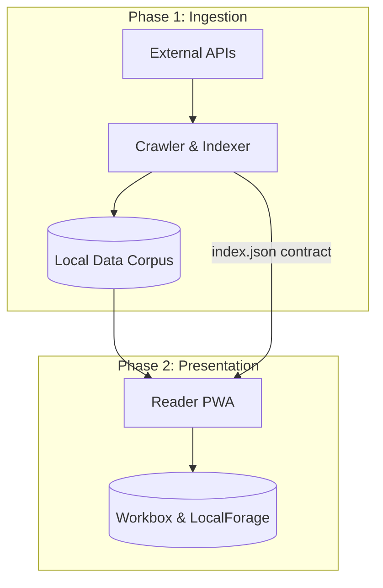

# Monkai

## Overview

Monkai is a comprehensive library and Progressive Web Application (PWA) designed for reading Buddhist sutras (Đọc kinh Phật). It is a multi-phase project that collects canonical texts from authoritative sources and serves them through an accessible, offline-capable interface.

## Purpose

The project bridges the gap between raw digital archives and modern reading experiences. By normalizing scriptures into a structured format and providing a native-like PWA, Monkai ensures that Buddhist texts are readily accessible, searchable, and readable even without an internet connection.

## Table of Contents

- [Quick Start](#quick-start)
- [Architecture](#architecture)
- [Project Structure](#project-structure)
- [Installation](#installation)
- [Usage](#usage)
- [Deployment](#deployment)
- [MCP Setup](#mcp-setup)
- [Contributing](#contributing)
- [License](#license)

## Quick Start

You can explore the two main components of Monkai in their respective directories:

1. **Crawler Pipeline**: Manages text ingestion and cataloging.
   ```bash
   cd apps/crawler
   devbox shell
   devbox run test
   ```
2. **Reader UI**: Provides the user interface for reading texts.
   ```bash
   cd apps/reader
   npm install
   npm run dev
   ```

## Architecture

Monkai is composed of two primary phases that separate data ingestion from the presentation layer:



### Phase 1: Crawler Pipeline (`apps/crawler`)

A configuration-driven Python application that securely and consistently fetches texts. It features incremental updates, duplicate detection across sources, and generates a frozen data contract (`index.json`) for the reader interface.

### Phase 2: Reader UI (`apps/reader`)

A React-based Progressive Web Application built with Vite and Tailwind CSS. It consumes the organized corpus to provide offline access, client-side search with Minisearch, and a customizable reading experience across mobile and desktop devices.

## Project Structure

- `apps/crawler/`: The Python-based ingestion pipeline. See the [Crawler documentation](apps/crawler/README.md) for details.
- `apps/reader/`: The Vite React application for reading. See the [Reader documentation](apps/reader/README.md) for details.
- `apps/deployer/`: Scripts to upload book-data to Vercel Blob and deploy the reader as a static site. See [Deployment](#deployment) and [apps/deployer/README.md](apps/deployer/README.md).
- `data/`: The shared corpus directory where the crawler outputs `index.json` and canonical data.
- `docs/`: Centralized project documentation and architecture plans.

## Installation

Ensure you have the required prerequisites for the sub-projects:

- Node.js (for the Reader UI)
- Devbox or Python 3.11 with `uv` (for the Crawler Pipeline)

Clone the repository to get started:

```bash
git clone <repo-url> monkai
cd monkai
```

## Usage

Follow the specific instructions within each application to run or deploy the services. 

- To run the crawler and build the scripture index, navigate to `apps/crawler/` and use Devbox.
- To serve the web application and read scriptures, navigate to `apps/reader/` and start the development server.

## Deployment

Deployment does not require the repository to be public or linked to Vercel via Git. Book-data is uploaded to **Vercel Blob**; the reader is deployed as a **static site** (e.g. via Vercel CLI).

See **[apps/deployer/README.md](apps/deployer/README.md)** for one-time setup (Blob store, tokens, Vercel CLI auth) and full instructions.

From repo root with Devbox:

- `devbox run deploy:book-data` — upload book-data to Vercel Blob (set `BLOB_READ_WRITE_TOKEN`).
- `devbox run deploy:reader` — build and deploy the reader (set `VITE_BOOK_DATA_URL` to the Blob store root after first upload).
- `devbox run deploy:all` — run upload then reader deploy (when `VITE_BOOK_DATA_URL` is already set).

## MCP Setup

MCP (Model Context Protocol) config is centralized for use with multiple agents (Claude Code, Cursor, Gemini). Secrets are gitignored.

1. Copy the example config and add your API keys:
   ```bash
   cp mcp.canonical.example.json mcp.canonical.json
   # Edit mcp.canonical.json with your keys
   ```
2. Sync to agent-specific locations:
   ```bash
   node scripts/sync-mcp-config.mjs
   ```
   This generates: `.mcp.json` (Claude Code), `.cursor/mcp.json` (Cursor), `.gemini/settings.json` (Gemini).

To add or change MCP servers, edit `mcp.canonical.json` and re-run the sync script.

## Contributing

We welcome contributions to both the crawler pipeline and the reader application.

1. Create a feature branch from your topic.
2. Develop your feature within the respective application directory.
3. Ensure all tests and linting checks pass in the specific app you are modifying.
4. Submit a pull request for review.

## License

Refer to the main `LICENSE` file at the root of the repository for detailed licensing information.
