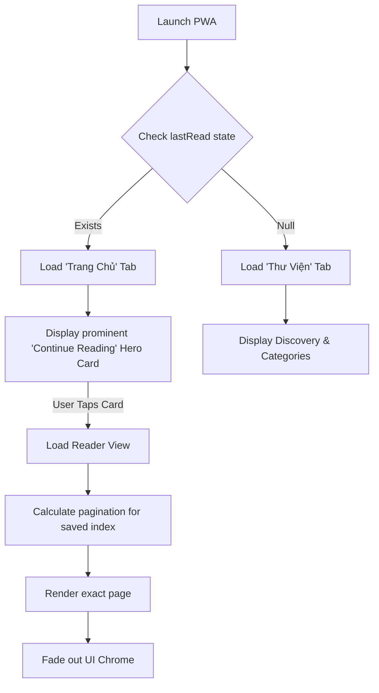
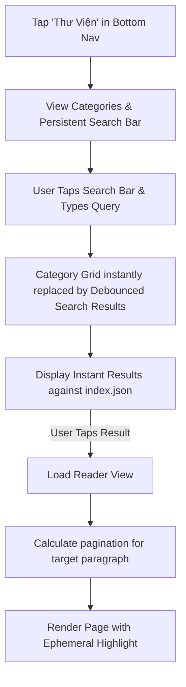
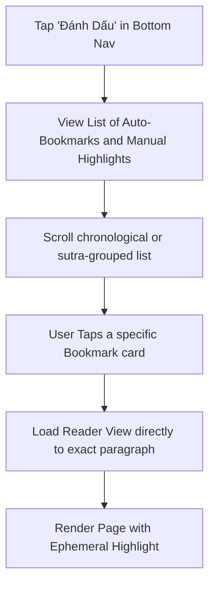
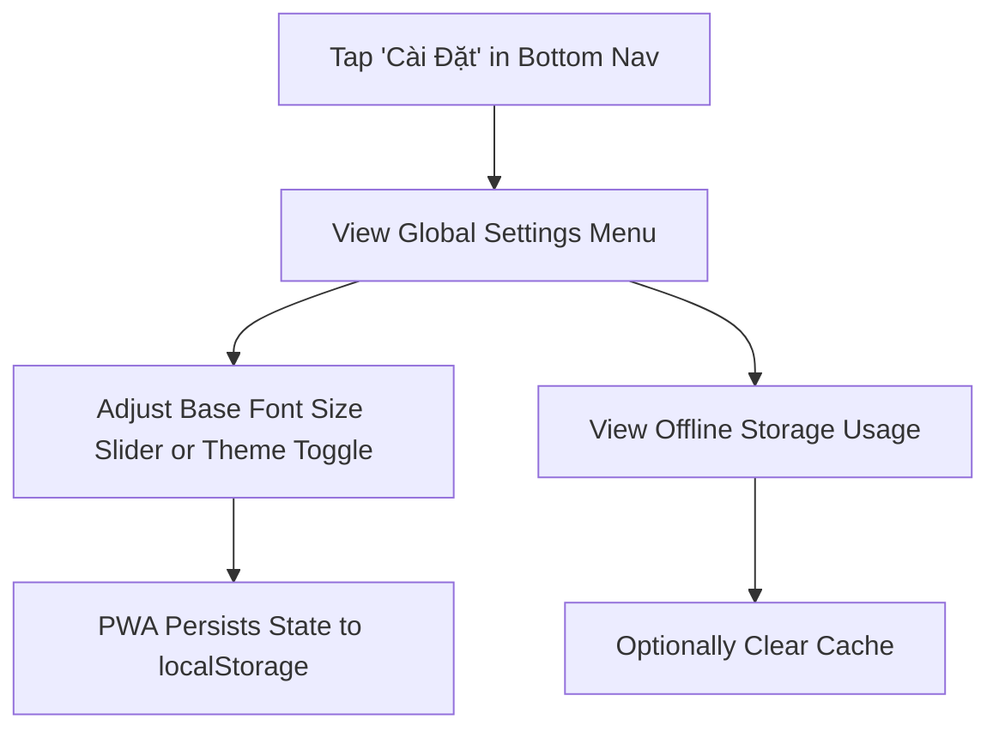

# UX Design Specification monkai

**Author:** Minh
**Date:** 2026-03-05T23:25:34+07:00

---

## Executive Summary

### Project Vision

Monkai Phase 2 is an offline-first, Progressive Web App designed to provide a fast, beautifully formatted, and distraction-free reading experience for Buddhist texts. By leveraging static JSON data, it ensures zero operational costs while delivering native-like performance and reliability.

### Target Users

- **The Devoted Practitioner:** Older, daily readers who need a stable, highly legible, paper-like digital experience with automatic progress saving and offline capabilities.
- **The Curious Beginner:** Younger or newer users who rely on fast, intuitive global search to discover specific texts without needing to understand complex Buddhist taxonomy.

### Key Design Challenges

- Implementing performant client-side pagination (page flipping) without UI stutter.
- Designing a highly accessible, distraction-free reading interface handling complex typography (diacritics, Pali/Sanskrit) and dynamic scaling.
- Communicating the offline capability and PWA installation process clearly to non-technical users.

### Design Opportunities

- Creating a uniquely calm and focused digital reading environment.
- Delivering instant, offline-first interactions that rival native applications.
- Establishing an abstracted UI foundation ready for future hybrid mobile expansion.

## Core User Experience

### Defining Experience

The primary user action is reading sutras seamlessly. This single interaction must be absolutely flawless, feeling exactly like physically flipping pages in a book, regardless of internet connection or device context.

### Platform Strategy

A Progressive Web App (PWA) initially built for Web, Mobile Safari, and Chrome mobile browsers, optimized heavily for touch (paginated swiping/tapping) while supporting desktop layouts. The architecture is intentionally abstracted to allow for a future hybrid mobile app transition (React Native/Capacitor).

### Effortless Interactions

- Transitioning from an online state to an offline reading state requires zero user intervention.
- Finding the exact spot where they left off reading yesterday is automatic—no manual bookmarks required.
- Turning a page is instantly responsive (under 50ms) and feels tactile.

### Critical Success Moments

- **The "Offline Magic" Moment:** When users realize they can read a complete text on an airplane without having explicitly "downloaded" it.
- **The Immersive Moment:** Losing track of the UI entirely and becoming fully absorbed in the text because the reader interface successfully stayed out of the way.

### Experience Principles

- **Readability is Paramount:** Content comes before interface. Typography and layout dictate every structural decision.
- **Zero Friction Offline:** Offline functionality is not a feature; it is the default state of the reading experience.
- **Tangible Interaction:** Navigation within a text should feel physical (pages) rather than digital (scrolling).

## Desired Emotional Response

### Primary Emotional Goals

- **Tranquility and Focus:** The overarching goal is to create a digital environment that feels sacred, calm, and entirely distraction-free, facilitating deep reading and reflection.
- **Trust and Reliability:** Users must implicitly trust that the application will work when they need it (offline) and remember where they left off without manual intervention.

### Emotional Journey Mapping

- **Discovery (First Use):** Relief and pleasant surprise at the instantaneous load time and the immediate presentation of a clean, beautifully designed reader.
- **Core Action (Reading):** Deep immersion. The interface should feel absent, focusing entirely on the typography and the text.
- **Task Completion (Closing App):** Reassurance. The user feels confident their session is securely bookmarked.
- **Error States (Missing Data):** Gentle guidance rather than jarring technical faults. The app should communicate issues with calm empathy.
- **Return Visit:** Welcomed familiarity, opening instantly to the exact page and sentence they were last reading.

### Micro-Emotions

- **Calmness vs. Distraction:** Critical priority. Every UI element must earn its place.
- **Trust vs. Uncertainty:** Particularly regarding offline availability and bookmark saving.
- **Delight vs. Frustration:** The tactile "feel" of flipping a page instantly compared to the chore of long vertical scrolling.

### Design Implications

- **Calmness →** Minimalist UI, an earthy natural color palette (vàng đất, nâu trầm, kem), ample whitespace, and elegant Serif typography for the core text.
- **Trust →** Subtle, unobtrusive visual indicators confirming offline readiness and saved progress.
- **Delight →** Smooth, 60fps page turn transitions (swipe/tap) that mimic the physical interaction of reading a book.
- **Absence of Anxiety →** No pop-ups, no generic "network error" modals. Soft fallback states for missing content.

### Emotional Design Principles

1. **The UI is Secondary:** The text is the primary focus; the interface should get out of the way.
2. **Respect the Reader's Peace:** Never interrupt the user with notifications, unpredictable animations, or complex onboarding.
3. **Fail Gracefully:** If an action fails (e.g., trying to search a term not in the index), respond with gentle, helpful feedback.
4. **Frictionless Continuity:** The transition from online to offline, or from one session to the next, must be entirely invisible to the user.

## UX Pattern Analysis & Inspiration

### Inspiring Products Analysis

**1. Apple Books / Kindle App (Mobile & Tablet)**
- **Core Success:** Replicating the physical act of reading.
- **Onboarding:** Immediate access to the library; no complex setup.
- **Interactions:** The physical "page curl" or instant snap pagination is deeply satisfying and immediately understood.
- **Visuals:** Highly customizable typography and backgrounds (Day/Night/Sepia) that respect user preference.

**2. Medium (Web & App)**
- **Core Success:** Pristine, distraction-free typography for long-form reading.
- **Interactions:** The UI fades away entirely when scrolling/reading begins.
- **Visuals:** Excellent use of whitespace, establishing a clear hierarchy that focuses entirely on the content.

**3. Wikipedia App**
- **Core Success:** Fast, offline-capable knowledge retrieval.
- **Navigation:** Excellent global search that works instantly, even with massive datasets.
- **Interactions:** Easy cross-referencing and clean structural navigation (Table of Contents).

### Transferable UX Patterns

**Navigation Patterns:**
- **Unified Discovery (Apple Music/Spotify):** Merging the "Library" browsing and "Search" into a single, powerful "Thư Viện" tab in the bottom navigation. The top of the screen is a persistent search bar, with categorized browsing below it that instantly swaps to search results when typing begins.
- **Hidden Context Menus:** Keeping the reader UI clean by hiding navigation (Library, Settings) behind a single tap on the center of the screen, revealing top/bottom bars only when needed.

**Interaction Patterns:**
- **Discrete Pagination (Apple Books):** Tap left/right or swipe to move to the next "page" of text, calculated dynamically rather than using infinite vertical scroll. This creates a sense of spatial memory and completion.
- **Auto-Save Progress:** Silently persisting the exact read location to `localStorage`/`IndexedDB` without the user ever clicking a "Save" button.

**Visual Patterns:**
- **Thematic Reading Environments (Apple Books):** Offering Vàng đất, nâu trầm, kem (Sepia/Cream) backgrounds with high-contrast text to reduce eye strain during long sessions.
- **Chromeless UI (Medium):** When reading is active, 100% of the screen real estate is dedicated to the sutra text.

### Anti-Patterns to Avoid

- **Infinite Vertical Scrolling for Books:** While great for social media, it destroys spatial memory and the sense of progress in long texts. Users lose their place easily if the app reloads.
- **Aggressive "Install App" Banners:** Intruding on the peaceful reading experience with massive pop-ups. We should use subtle, standard browser PWA install prompts.
- **Overly Complex Categorization Trees:** Forcing users to click through 5 levels of taxonomy just to find a popular text. Search must be immediate.
- **Blocking Loading States:** Showing a spinner while waiting for a network request when the user just wants to read what's already cached.

### Design Inspiration Strategy

**What to Adopt:**
- **The Chromeless Reader:** The interface must disappear entirely during active reading.
- **Discrete Pagination:** We will invest engineering effort into client-side pagination to mimic a physical book.

**What to Adapt:**
- **Offline Capabilities:** We will adapt standard PWA generic offline states into a seamless, "always-available" feeling tailored to our static JSON catalog.
- **Typography:** We will adapt Medium's clean typography approach, specifically testing fonts that render Vietnamese diacritics and Pali characters flawlessly.

**What to Avoid:**
- **Social/Community Clutter:** In Phase 2, we will strictly avoid comments, likes, or upvotes that detract from the solitary, calm reading experience.

## Design System Foundation

### 1.1 Design System Choice

**Custom Design System using Tailwind CSS and Unstyled Accessible Primitives (e.g., Radix UI).**

### Rationale for Selection

1. **Bespoke Core Interaction:** The paginated reader engine is highly custom and not supported by standard UI libraries (like MUI or Ant Design). A custom system prevents fighting pre-existing component constraints.
2. **Performance & Bundle Size:** Achieving instant load times and 60fps page turns requires minimal CSS payloads, which Tailwind's utility-first, purged CSS architecture provides perfectly.
3. **Aesthetic Control:** The UI must feel like a calm printed book, not generic software. A custom system guarantees absolute control over the earthy color palette and complex typography needs without overriding heavy default themes.
4. **Accessibility First:** Utilizing unstyled primitives ensures that crucial interactions (modals, dropdowns) remain fully accessible to screen readers while allowing 100% custom styling.

### Implementation Approach

1. **Design Tokens:** Define strict design variables (Colors: Vàng đất, nâu trầm, kem; Spacing scales; Typography scales) globally within `tailwind.config.js`.
2. **Component Strategy:** Build a small set of reusable, highly specific components (e.g., `<ReaderPage>`, `<SutraListCard>`) rather than a massive generic library.
3. **CSS Architecture:** Rely exclusively on Tailwind utility classes for styling to avoid CSS-in-JS runtime overhead and prevent specificity wars.

### Customization Strategy

- The design system will enforce a strict "Chromeless Default" where reading UI components dynamically fade out or hide when text interaction begins.
- Typography scales will be fluid, adapting mathematically based on user preferences and device viewport to maintain optimal characters-per-line (CPL).

## 2. Core User Experience

### 2.1 Defining Experience

The defining experience of Monkai is the **instantaneous, paginated page turn**. If the act of moving through a heavy Buddhist sutra feels light, tactile, and completely reliable—even offline—the app succeeds. The reading interface must mimic the spatial memory of a physical book while offering the typographic flexibility of the web.

### 2.2 User Mental Model

Users currently rely on either physical books (which are heavy and hard to search) or traditional websites (which use infinite vertical scrolling). Vertical scrolling is problematic for deep reading because it destroys spatial memory; users easily lose their place if the page jumps. The mental model we are building to is the *e-reader* (Kindle/Apple Books), where text is broken into distinct, screen-sized "pages."

### 2.3 Success Criteria

1. **Zero-Latency Pagination:** Tapping to turn a page must visually respond in under 50ms, maintaining 60fps.
2. **Perfect Reflow:** Text must never be cut off horizontally or vertically, regardless of the user's device size or chosen font scale.
3. **Absolute Persistence:** The app must remember the exact page a user was on across completely closed sessions, opening directly to that spot instantly upon reload.

### 2.4 Novel UX Patterns

We are bringing the established pattern of native e-readers into the browser context. Because we are dynamically calculating page breaks from raw JSON data rather than pre-rendered EPUBs, the technical implementation is novel for a PWA. We will rely on universally understood touch zones (tap right to advance, tap left to go back) to ensure zero learning curve.

### 2.5 Experience Mechanics

**The Page Turn Flow:**
1. **Initiation:** The user taps the right edge of the screen (or swipes left).
2. **Interaction (Client):** The pagination engine instantly accesses the pre-calculated array of paragraphs that fit the *next* viewport state.
3. **Feedback:** The screen transitions instantly. A subtle, minimalist progress indicator (e.g., a thin bar or discreet fraction like 14/89) updates at the bottom of the screen.
4. **Completion:** The system silently updates the user's `lastReadPosition` in the abstracted storage layer (e.g., IndexedDB), ensuring safe recovery even if the browser crashes immediately after the turn.

## Visual Design Foundation

### Color System

The color system is built around three distinct reading themes to accommodate user environments while maintaining the brand's calm, earthy identity.

1. **Sepia Motif (Default):**
   - Background: Kem (`#F5EDD6`) - Simulates aged paper, reducing eye strain.
   - Primary Text: Nâu trầm (`#3D2B1F`) - Softer contrast than pure black, invoking ink.
   - Accent/Interactive: Vàng đất (`#C8883A`) - Used sparingly for active states or highlights.
2. **Light Motif:** High contrast (near white background, near black text) for bright outdoor environments.
3. **Dark Motif:** Low light environment safe (deep grey background, off-white text) for night reading.

*Accessibility Note:* All text-to-background color pairings across all three themes must mathematically pass WCAG AA contrast standards (minimum 4.5:1).

### Typography System

The typography strictly separates the "content" (the sutras) from the "chrome" (the UI).

- **Primary Typeface (Sutras):** A highly legible web-safe Serif (e.g., Lora or Merriweather). **Crucially**, it must perfectly render Vietnamese diacritics and Pali/Sanskrit extended Latin characters without rendering fallback glyphs.
- **Secondary Typeface (UI/Navigation):** A modern, neutral Sans-Serif (e.g., Inter) for menus, search inputs, and navigation bars to visually separate interactive elements from reading material.
- **Type Scale:** Fluid typography based on viewport size. The default body size will be generously proportioned (e.g., 18px-20px base) to support older demographics, with a user-facing toggle to scale up to 200%.

### Spacing & Layout Foundation

- **The Reading Column:** The core sutra text will be constrained to an optimal reading width of 60-70 characters per line (approx. 650px - 750px max-width on desktop). This prevents eye fatigue caused by scanning overly wide lines.
- **Whitespace:** Ample use of whitespace (padding and margins based on an 8px grid) to create a sense of calm and prevent visual crowding. 
- **Alignment:** Sutra text will generally be left-aligned (ragged right) rather than justified, as browser-based justification often creates distracting "rivers of white" that hinder accessibility.

### Accessibility Considerations

- All interactive touch targets (page turn zones, menu icons) will be at least 44x44 CSS pixels.
- The UI will remain fully functional without color (relying on contrast and iconography).
- Screen reader respect: The paginated view will expose logical ARIA landmarks so visually impaired users can navigate the structured document smoothly, even if the visual presentation is cut into "pages."

## Design Direction Decision

### Design Directions Explored

1.  **The Modern Reading App:** A high-contrast, utility-focused design with persistent floating navigation bars.
2.  **The Classic Book (Chromeless):** An immersive, typography-first design using the earthy color palette, where all UI navigation is hidden during active reading.

### Chosen Direction

**Direction 2: The Classic Book (Chromeless)**

### Design Rationale

This direction was chosen because it perfectly supports the primary emotional goal of "Tranquility and Focus." By hiding the UI chrome (navigation bars, setting toggles) during active reading, the application respectfully centers the Buddhist text. It leverages the chosen color palette (vàng đất, nâu trầm, kem) to simulate a physical, calming reading surface rather than a glowing digital application. This direction best serves both the Devoted Practitioner (who wants a paper-like experience) and the core defining experience of immersive, paginated reading.

### Implementation Approach

-   **State Management:** The Reader component will have an internal `isChromeVisible` boolean state.
-   **Interaction:** Tapping the center 60% of the screen toggles `isChromeVisible`. Tapping the left/right 20% triggers pagination.
-   **Animation:** UI overlays (top navigation, bottom progress/settings bar) will slide in/out gracefully over the text layer when toggled, without violently reflowing the text layout.

## User Journey Flows

### Prototype Reference (Stitch MCP)
The visual prototypes for these flows have been generated using the Stitch MCP.
**Project Name:** PWA Reader UI Prototype
**Project ID:** `7608307594726401832`

**Generated Screens:**
1. **Trang Chủ (Home) Screen** (`2ee257046e314c00b0b9fbd9f95a451c`): The Home view with 'Continue Reading' hero card and bottom navigation active.
2. **Thư Viện (Library) Screen** (`d6ee9ebf64cc489da9ecbe3dcb3e9471`): The unified discovery hub with a prominent top search bar, category grid, and bottom navigation.
3. **Thư Viện (Active Search)** (`8a023b5fdae84248b17c5037fe928b89`): The Library view swapped to debounced search results for 'Bát Nhã'.
4. **Tất cả danh mục (All Categories)** (`da20a795cfc946338c2254c4c9392efe`): The vertically scrollable list of all sutra categories.
5. **Đánh Dấu (Bookmarks) Screen** (`836ecc57482c48bbb00019aad815f4a4`): The list of saved verses and progress cards with bottom navigation active.
6. **Cài Đặt (Settings) Screen** (`f2dbf1affb914716aa95f4db02a1755c`): The global preferences view for typography, theme, and offline storage management.

### Journey 1: The Daily Practitioner (Smart Resume via Trang Chủ)

This flow is optimized for 1-tap reentry from the app icon. It relies entirely on `localStorage`/`IndexedDB` state persistence and focuses on the "Trang Chủ" (Home) tab.

### Journey 2: The Scholar (Deep Search & Discovery via Thư Viện)

This flow utilizes the newly unified Library & Search Hub within the "Thư Viện" tab for zero-latency, offline-capable discovery.

### Journey 3: The Dedicated Student (Managing Bookmarks via Đánh Dấu)

This flow utilizes the "Đánh Dấu" tab to manage saved progress or specific highlighted passages.

### Journey 4: The Environment Adapter (Global Preferences via Cài Đặt)

This flow handles global application preferences through the "Cài Đặt" tab, ensuring reading comfort across all sessions.

### Journey Patterns

**Navigation Patterns:**
- **The Chromeless Toggle:** Center-tap to toggle all navigation UI on/off.
- **Unified Bottom Navigation:** Four primary tabs (Trang Chủ, Thư Viện, Đánh Dấu, Cài Đặt) provide immediate access to all non-reading functions, keeping the Home screen clean and focused solely on "Continue Reading".
- **Smart Resume:** The most prominent action on the Trang Chủ (Home) screen is always returning to the exact previous reading state.

**Feedback Patterns:**
- **Ephemeral Highlights:** When navigating via search, the target text is highlighted for 1.5 seconds before fading to match the text color, preventing visual disruption during reading.
- **Silent Saves:** Progress is saved constantly in the background on every page turn without requiring user confirmation.

### Flow Optimization Principles

1. **Minimizing Steps to Value:** The Daily Practitioner journey requires exactly one tap to resume reading from a cold start.
2. **Non-Intrusive Prompts:** PWA installation and offline caching prompts only appear after the user has demonstrated engagement (e.g., reading multiple pages) or explicitly triggered the UI chrome.

## Component Strategy

### Design System Components
We are utilizing Tailwind CSS for styling and Radix UI for unstyled, accessible interactive primitives (Dialogs, Sliders). This ensures a tiny CSS footprint and perfect accessibility without fighting pre-existing visual themes.

### Custom Components

#### `<ReaderEngine>`
**Purpose:** Handles the complex logic of client-side pagination from raw JSON paragraph arrays.
**Usage:** The central reading interface.
**Anatomy:** Full-width container with invisible left/right tap zones for pagination.
**Interaction Behavior:** Intercepts taps/swipes to instantly calculate and render the next viewport-height chunk of text. Emits events for background progress saving.

#### `<ChromelessLayout>`
**Purpose:** Wraps the reader to provide the immersive "Classic Book" experience.
**Anatomy:** Top navigation (metadata), Bottom navigation (progress/settings), and the central content slot.
**States:** `isVisible` (true/false) determining the opacity and interactivity of the navigation chrome.
**Interaction Behavior:** Center-screen taps fluidly toggle the navigation visibility.

#### `<LibrarySearchHub>`
**Purpose:** Replaces the isolated `SearchOverlay` by combining global catalog browsing and instant search into a single destination.
**Usage:** The primary view when the "Thư Viện" tab is active.
**Interaction Behavior:** Contains a sticky search input. When empty, renders `<CategoryList>`. When text is entered, instantly swaps the view to `<SearchResults>` using a debounced fuzzy search against the cached `index.json`.

### Component Implementation Strategy
All custom components will be built as modular React components using strictly Tailwind utility classes for styling. No runtime CSS-in-JS libraries will be used to ensure maximum rendering performance.

### Implementation Roadmap
- **Phase 1 (The Core):** `<ReaderEngine>`, `<ChromelessLayout>`, and Bottom Navigation routing shell.
- **Phase 2 (Discovery):** Unified `<LibrarySearchHub>` integrating instant search and categorized browsing.
- **Phase 3 (Polish):** `<BookmarksView>`, `<ReadingSettings>`, and offline PWA installation logic.

## UX Consistency Patterns

### Feedback Patterns
- **Subdued Notifications:** Avoid bright, high-contrast toast notifications. Use in-place text swaps (e.g., changing a "Download" icon to a "Check" icon) or edge-aligned notifications that match the current reading theme's background color to minimize visual disruption.
- **Ephemeral Highlights:** When jumping to a specific search result, use a soft background highlight that fades out over 1.5 seconds, drawing the eye without requiring the user to manually dismiss it.

### Loading States
- **Skeleton Text:** Avoid generic spinning loaders. Use pulsing skeleton text blocks that match the line-height and layout of the actual sutra text to maintain the structural feel of a book even while data is fetching.
- **Optimistic UI:** When a user triggers an action (like changing a setting or turning a page), the UI should reflect the change instantly, assuming success, rather than blocking the UI while waiting for background saves (`IndexedDB`).

### Error Recovery (Offline Grace)
- **Calm Error States:** Never show raw browser errors. If an uncached text is requested while offline, display a gracefully formatted page in the active theme stating the content is unavailable, with a direct, single-tap pathway back to the locally available Library.
- **Silent Retries:** Network failures for background telemetry or analytics (if any) should fail silently and queue for retry without ever alerting the user.

### Discoverability Patterns
- **First-Touch Tooltips:** To teach the "Chromeless" interaction, the UI chrome will be visible on the very first load, autonomously fading out after a short delay with a brief, text-based hint ("Chạm vào giữa màn hình để hiện menu") that is completely removed from the DOM after the first successful interaction.

## Responsive Design & Accessibility

### Responsive Strategy

Monkai takes a mobile-first approach but uses responsive container constraints to ensure comfortable reading on larger screens.

- **Mobile (< 768px):** The reader utilizes the full screen width. Pagination is handled via tapping the left/right 20% edges of the screen or swiping.
- **Tablet & Desktop (>= 768px):** To maintain print-like readability, the main text column is constrained to an optimal `max-width` (approximately 65-70 characters per line or ~700px) and horizontally centered. The empty margins on the left and right become massive, comfortable tap/click zones for pagination. Keyboard navigation (Arrow keys, Page Up/Down) is fully supported.

### Breakpoint Strategy

We rely on fluid typography and `max-width` containers rather than aggressive breakpoint snapping, ensuring smooth scaling across any device metric. We adapt Tailwind's default scale:
- base: Mobile edge-to-edge
- `md` (768px): Constrain text column width.
- `lg` (1024px): Reveal persistent sidebar library on home screen (if applicable in future phases).

### Accessibility Strategy

Targeting WCAG AA compliance is critical given our older target demographic.

- **Fluid Type Scale:** Users must be able to adjust the base text size from 100% up to 200% without horizontal scrolling or clipping.
- **Contrast Guarantee:** All three reading themes (Sepia, Light, Dark) must strictly adhere to the 4.5:1 contrast ratio for text elements.
- **Touch Areas:** All discrete interactive UI elements (icons, links, buttons) require a minimum 44x44px tap target area, even if the visible asset is smaller.

### Testing Strategy

- **Device Matrix:** Physical testing on at least one low-end Android device (to measure pagination calculation latency), an iPad, and an iPhone.
- **Accessibility Tools:** Automated audits via Lighthouse and visual testing using color blindness simulators (e.g., Stark plugin). Screen reader tests specifically for the custom pagination engine to ensure continuity of text.
- **Manual QA:** Keyboard-only navigation test to ensure entirely mouse-less operability on desktop.

### Implementation Guidelines

- Strictly use CSS relative units (`rem`, `em`, `vh`, `vw`, `ch`) instead of fixed `px` values for typography and container widths.
- Implement `aria-hidden="true"` on non-essential decorative elements (like chapter ornaments) and ensure custom modals trap keyboard focus using a library like `focus-trap-react` or Radix UI Dialog primitives.

