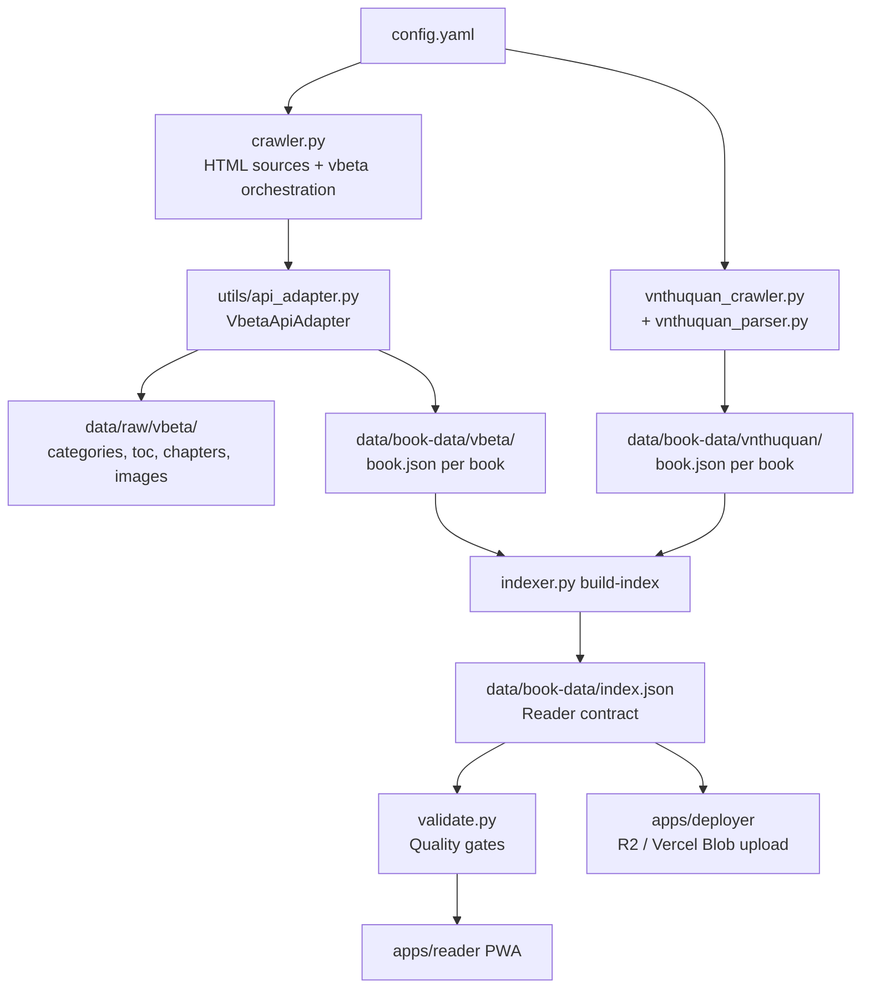

# Monkai Crawler

> Python ingestion pipeline for the [Monkai](../..) monorepo — crawls Buddhist scripture sources, normalizes them into structured `book.json` files, and builds the `index.json` contract consumed by the [Reader PWA](../reader/README.md).

## Table of Contents

- [Overview](#overview)
- [Architecture](#architecture)
- [Quick Start](#quick-start)
- [Commands](#commands)
- [Configuration](#configuration)
- [Data Layout](#data-layout)
- [Data Models](#data-models)
- [Project Structure](#project-structure)
- [Testing](#testing)
- [Tools](#tools)
- [Related Apps](#related-apps)

## Overview

The crawler collects Buddhist scriptures from authoritative Vietnamese digital libraries, normalizes them into a shared corpus format, and validates quality gates before handoff to the reader.

**What you get:**

- Configuration-driven crawling with `robots.txt` compliance and rate limiting
- Deterministic, deduplication-safe IDs via Vietnamese-aware slug generation
- Incremental, resumable crawl state (`data/crawl-state.json`)
- Canonical **BookData v2.0** output — one `book.json` per book
- Central manifest at `data/book-data/index.json` for the reader and deployer

**Supported scripture traditions:**

| Tradition | Vietnamese | Description |
|-----------|------------|-------------|
| Nikaya | Nguyên Thủy | Theravāda — Pali canon |
| Đại Thừa | Đại Thừa | Mahāyāna — East Asian Buddhism |
| Mật Tông | Mật Tông | Vajrayāna — Tantric Buddhism |
| Thiền | Thiền | Zen Buddhism |
| Tịnh Độ | Tịnh Độ | Pure Land Buddhism |

**Configured sources** (`config.yaml`):

| Source | Type | URL | Status |
|--------|------|-----|--------|
| `vbeta` | API | `api.phapbao.org` | Enabled |
| `vnthuquan` | HTML | `vietnamthuquan.eu` | Enabled |
| `thuvienhoasen` | HTML | `thuvienhoasen.org` | Disabled (robots.txt) |
| `thuvienkinhphat` | HTML | `thuvienkinhphat.net` | Disabled |

## Architecture



### vbeta (API)

`crawler.py` delegates API sources to `VbetaApiAdapter` in `utils/api_adapter.py`:

1. **Phase 1 — Raw crawl:** categories, book lists, TOC, chapter pages, and images → `data/raw/vbeta/`
2. **Phase 2 — Build:** assembles **BookData v2.0** → `data/book-data/vbeta/{category}/{book}/book.json`

Covers image download, local path rewriting in chapter HTML, and skip-if-on-disk idempotency.

### VNThuQuan (HTML)

Dedicated scraper with its own HTTP layer and pure parsers:

- **`VnthuquanAdapter`** — async HTTP, rate limiting, exponential backoff, session health monitoring
- **`vnthuquan_parser.py`** — pure parsing (no I/O): listing pages, book detail, chapter AJAX
- **Chapter AJAX** — `GET vietnamthuquan.eu/truyen/chuonghoi_moi.aspx?tid=…`
- **Incremental index** — appends to `data/book-data/vnthuquan/index.json` after each book
- **CLI extras** — `crawl` and `backfill-covers` commands

### Design principles

- **Single config file** — sources and selectors in `config.yaml`
- **Deterministic IDs** — `{source}__{title_slug}` via `make_id()` / `slugify_title()`
- **Resumable** — per-URL state in `data/crawl-state.json`
- **Robot-compliant** — `robots.txt` cached per domain
- **Idempotent** — re-runs skip existing files on disk and in state

## Quick Start

From the **repository root** (recommended):

```bash
git clone <repo-url> monkai
cd monkai
devbox shell          # Python 3.11 + uv; runs `uv sync` on enter

# Verify crawler tests (318 tests)
devbox run test:crawler

# Crawl vbeta API source
devbox run crawl

# Crawl VNThuQuan HTML source
devbox run crawl-vnthuquan

# Full pipeline: crawl → build-index → validate
devbox run pipeline
```

Or work directly inside `apps/crawler/`:

```bash
cd apps/crawler
uv sync               # from repo root pyproject.toml
uv run pytest         # run tests
uv run python crawler.py crawl --source vbeta
uv run python vnthuquan_crawler.py crawl
uv run python indexer.py build-index
uv run python validate.py
```

## Commands

### Devbox scripts (from repo root)

| Command | Description |
|---------|-------------|
| `devbox run test:crawler` | Run crawler pytest suite |
| `devbox run crawl` | Run vbeta / enabled HTML sources via `crawler.py` |
| `devbox run crawl-vnthuquan` | Run VNThuQuan crawler |
| `devbox run pipeline` | End-to-end: crawl → build-index → validate |
| `devbox run sync:book-data` | Upload book-data to R2 (via `apps/deployer`) |
| `devbox run deploy:book-data` | Upload book-data to Vercel Blob |
| `devbox run deploy:all` | Upload corpus + deploy reader |

> **Note:** `devbox run test` runs the **reader** test suite. Use `test:crawler` for this app.

### CLI entry points (from `apps/crawler/`)

| Script | Usage |
|--------|-------|
| `crawler.py` | `uv run python crawler.py crawl [--source all\|vbeta\|…]` |
| `vnthuquan_crawler.py` | `uv run python vnthuquan_crawler.py crawl [options]` |
| | `uv run python vnthuquan_crawler.py backfill-covers` |
| `indexer.py` | `uv run python indexer.py build-index [--source vnthuquan]` |
| `validate.py` | `uv run python validate.py` — schema + quality gates |
| `pipeline.py` | `uv run python pipeline.py` — orchestrates all stages |

**VNThuQuan crawl options:** `--start-page`, `--end-page`, `--resume/--no-resume`, `--rate-limit`, `--concurrency`, `--max-hours`, `--dry-run`

### Lint / format

```bash
cd apps/crawler
uv run ruff check .
uv run ruff format .
```

## Configuration

`config.yaml` is the single configuration file, loaded by `utils/config.py`.

```yaml
output_dir: data
log_file: logs/crawl.log

sources:
  - name: vbeta
    source_type: api
    enabled: true
    rate_limit_seconds: 1.5
    output_folder: vbeta
    api_base_url: "https://api.phapbao.org/api"
    api_endpoints:
      category: "/categories/get-selectlist-categories?hasAllOption=false"
      book: "/search/get-books-selectlist-by-categoryId"
      toc: "/search/get-tableofcontents-by-bookId"
      chapter: "/search/get-pages-by-tableofcontentid"

  - name: vnthuquan
    source_type: html
    enabled: true
    seed_url: "http://vietnamthuquan.eu/truyen/?tranghientai=1"
    rate_limit_seconds: 1.5
    output_folder: vnthuquan
```

To add an HTML source: add an entry under `sources` with `css_selectors` and `seed_url`. API sources require `api_base_url` and `api_endpoints`.

## Data Layout

All paths are relative to `apps/crawler/` (the working directory when scripts run).

```text
data/
├── raw/                          # vbeta raw API payloads + images
│   └── vbeta/
│       ├── categories.json
│       ├── books/
│       ├── toc/
│       ├── chapters/
│       └── images/
├── book-data/                    # Canonical corpus (BookData v2.0)
│   ├── index.json                # Central manifest — reader contract
│   ├── vbeta/
│   │   └── {category}/{book}/book.json
│   └── vnthuquan/
│       ├── index.json            # Per-source incremental index
│       └── {category}/{book}/book.json
├── books/                        # Legacy book-level manifests (indexer compat)
│   └── index.json
└── crawl-state.json              # Resumable per-URL download state

logs/
└── crawl.log                     # Rotating log file
```

## Data Models

All models live in `models.py` (Pydantic v2).

### BookData v2.0 (canonical)

One file per book at `data/book-data/{source}/{category}/{book}/book.json`:

```python
class BookData(BaseModel):
    meta: BookMeta = Field(..., alias="_meta")   # schema_version "2.0"
    id: str                                      # e.g. "vbeta__bo-trung-quan"
    book_id: int
    book_name: str
    book_seo_name: str
    cover_image_url: str | None
    cover_image_local_path: str | None
    category_name: str
    total_chapters: int
    chapters: list[ChapterEntry]               # each with pages[].html_content
```

### BookIndex (reader contract)

Written to `data/book-data/index.json` by `indexer.py build-index`:

```python
class BookIndex(BaseModel):
    meta: BookIndexMeta = Field(..., alias="_meta")
    books: list[BookIndexEntry]   # UUID id, artifacts[], source, total_chapters, …
```

### Legacy schemas

- **`ChapterBookData` (v1.0)** — one JSON per chapter; deprecated but still supported by indexer for old data
- **`ScriptureMetadata` / `IndexRecord`** — Phase 1 HTML download metadata; used by disabled HTML sources
- **`BookIndexRecord`** — legacy flat index at `data/books/index.json`

## Project Structure

```text
apps/crawler/
├── config.yaml
├── crawler.py               # Typer CLI — HTML sources + vbeta orchestration
├── vnthuquan_crawler.py     # VNThuQuan crawler + Typer CLI
├── vnthuquan_parser.py      # Pure HTML parsers (no I/O)
├── pipeline.py              # crawl → build-index → validate
├── indexer.py               # build-index, legacy index command
├── validate.py              # BookData validation + quality gates
├── models.py                # Pydantic models
├── utils/
│   ├── api_adapter.py       # VbetaApiAdapter (two-phase crawl + build)
│   ├── config.py
│   ├── dedup.py
│   ├── logging.py
│   ├── robots.py
│   ├── slugify.py
│   └── state.py
├── tools/
│   ├── cleanup_placeholder_covers.py
│   └── README.md
├── tests/                   # 318 tests
└── data/                    # Created on first crawl (not committed)
```

## Testing

```bash
# From repo root
devbox run test:crawler

# From apps/crawler/
uv run pytest
uv run pytest tests/test_api_adapter.py -v   # single module
```

| Test file | Coverage |
|-----------|----------|
| `test_slugify.py` | Vietnamese slug / ID generation |
| `test_metadata_schema.py` | Pydantic validation, enums |
| `test_dedup.py` | SHA-256 duplicate detection |
| `test_robots.py` | robots.txt caching |
| `test_incremental.py` | Crawl state persistence |
| `test_crawler.py` | CLI, config, robots enforcement |
| `test_catalog_fetch.py` | Catalog fetch, pagination |
| `test_download.py` | Format detection, async download |
| `test_crawl_state_integration.py` | State tracking, interrupt handling |
| `test_deduplication.py` | Cross-source dedup |
| `test_api_adapter.py` | vbeta two-phase adapter |
| `test_api_models.py` | vbeta API DTOs |
| `test_indexer.py` | Index manifest generation |
| `test_vnthuquan_parser.py` | Listing, detail, chapter AJAX parsing |
| `test_vnthuquan_crawler.py` | HTTP adapter, retry, health |
| `test_vnthuquan_integration.py` | End-to-end VNThuQuan flow |
| `test_e2e_pipeline.py` | Full pipeline integration |
| `test_cleanup_placeholder_covers.py` | Cover cleanup tool |

## Tools

Maintenance scripts live in `tools/`. See [tools/README.md](tools/README.md) for `cleanup_placeholder_covers.py` — detects shared placeholder cover images by SHA-256 hash and optionally removes them from `book.json` and index files.

## Related Apps

| App | Role |
|-----|------|
| [apps/reader](../reader/README.md) | React PWA — consumes `data/book-data/index.json` |
| [apps/deployer](../deployer/README.md) | Upload book-data to R2 / Vercel Blob; deploy reader |
| [Root README](../../README.md) | Monorepo overview, deployment, MCP setup |

## Dependencies

Managed in the repo-root `pyproject.toml`:

| Package | Purpose |
|---------|---------|
| `aiohttp` | Async HTTP client |
| `beautifulsoup4` | HTML parsing |
| `pydantic` | Schema validation |
| `pyyaml` | Config loading |
| `typer` | CLI framework |
| `requests` | Sync HTTP (utilities) |
| `playwright` | Browser automation (reserved / future use) |
| `pytest`, `pytest-asyncio`, `aioresponses`, `ruff` | Dev / test |
