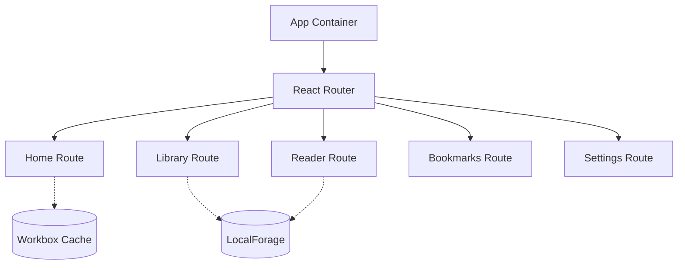

# Monkai Reader UI

## Overview

Monkai is a Progressive Web Application (PWA) designed for reading Buddhist sutras (Đọc kinh Phật). It provides an accessible, offline-capable, and user-friendly interface for reading, searching, and managing sutras across devices.

## Purpose

The Reader UI allows users to access Buddhist texts seamlessly, even without an active internet connection. As a PWA, it can be installed on mobile and desktop devices, offering a native-like experience while remaining lightweight.

## Table of Contents

- [Quick Start](#quick-start)
- [Features](#features)
- [Installation](#installation)
- [Usage](#usage)
- [Architecture](#architecture)
- [Development Workflow](#development-workflow)
- [Contributing](#contributing)
- [License](#license)

## Quick Start

To quickly start the development server with mock data:

```bash
npm install
npm run dev
```

The application runs locally and proxies API requests if the `VITE_BOOK_DATA_URL` environment variable is provided.

## Features

- **Progressive Web App**: Installable on Android, iOS, and Desktop devices.
- **Offline Reading**: Caches content with Workbox and localforage for offline access.
- **Search**: Fast, client-side text search powered by Minisearch.
- **Reading Experience**: Customizable settings, bookmarks, and a dedicated library interface.
- **Responsive Design**: Mobile-first layouts using Tailwind CSS.

## Installation

Ensure you have Node.js and a package manager (e.g., npm, pnpm) installed.

1. Clone the repository and navigate to the Reader UI directory:

   ```bash
   cd apps/reader
   ```

2. Install dependencies:

   ```bash
   npm install
   ```

3. (Optional) Set up environment variables in `.env.development` or `.env.production`:

   ```env
   VITE_BASE_PATH=/
   VITE_BOOK_DATA_URL=https://example-api.com
   ```

## Usage

### Development Server

Start the development server with hot-module replacement (HMR):

```bash
npm run dev
```

### Build for Production

Compile TypeScript and build the static assets for production:

```bash
npm run build
```

Preview the production build locally:

```bash
npm run preview
```

### Running Tests

Run unit tests and UI tests with Vitest:

```bash
npm run test
```

Run end-to-end tests using Playwright:

```bash
npm run e2e
```

## Architecture

The Reader UI is built with modern front-end tools:

- **Framework**: React 18 with TypeScript
- **State Management**: Zustand (global state) and React Query (server state and data fetching)
- **Styling**: Tailwind CSS with Radix UI headless components
- **Routing**: React Router DOM (v7)
- **PWA**: vite-plugin-pwa with Workbox for service worker generation
- **Build Tool**: Vite

### Application Structure

- `src/features/`: Contains feature modules (Home, Library, Reader, Bookmarks, Settings)
- `src/shared/`: Shared components, utilities, and constants
- `src/stores/`: Zustand global state definitions
- `src/lib/`: External library configurations (e.g., Minisearch, LocalForage)



## Development Workflow

1. Create a feature branch from the main branch.
2. Develop your feature or bug fix in the `src/` directory.
3. Ensure all tests and linting checks pass:
   ```bash
   npm run lint
   npm run typecheck
   npm run test
   ```
4. Commit your changes and submit a pull request.

## Contributing

We welcome contributions to the Monkai Reader UI.

1. Review the existing issues before creating a new one.
2. Follow the established code style and use the provided ESLint and TypeScript configurations.
3. Include tests for any new features or bug fixes.
4. Update this documentation if architectural changes occur.

## License

Please refer to the repository's main LICENSE file for licensing information.
